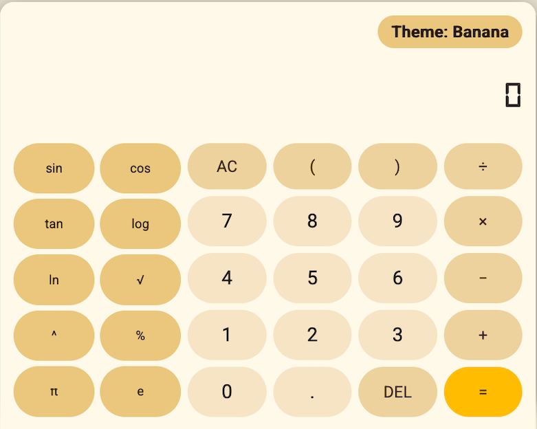

# 🧮 Calculator

A fun calculator app that actually feels like a real physical calculator.

Calculator is designed with nostalgic digital calculator vibes, customizable themes, and a clean experience without annoying paywalls.

---

## ✨ Features

### 🧮 Real Calculator Feel

* Digital-style calculator font
* Chunky calculator buttons
* Designed to feel like a physical calculator
* Smooth and simple UI

### 🎨 Themes

Switch between fun themes like:

* 🍌 Yellow Banana
* 🤖 Android
* 🕹️ Vintage
* 🌙 Dark themes
* 🎨 More funny and cool themes coming later

### 🚫 No Paywall

Everyone needs a calculator.

No subscriptions.
No locked buttons.
No “upgrade to calculate” nonsense.

### 🛠️ Open Source

Calculator is open source for personal use under:

**Creative Commons NonCommercial (CC BY-NC)**

That means you can:

* Explore the source code
* Learn from the project
* Add your own themes
* Modify the UI
* Make personal custom versions

But you cannot:

* Sell the app
* Reupload paid versions
* Use it commercially without permission

---

# 📸 Screenshots

## Banana Theme



---

# 🌐 Try It

## Web Version

Open:

```txt
web.html
```

## Native Releases

Download native builds here:

👉 [https://github.com/Ayysail/Calculator/releases](https://github.com/Ayysail/Calculator/releases)

---

# 📦 Installation

## Clone the Repository

```bash
git clone https://github.com/Ayysail/Calculator.git
```

## Open the App

Open:

```txt
index.html
```

or

```txt
web.html
```

inside your browser.

---

# 🎨 Creating Themes

Themes are one of the main parts of Calculator.

You can make:

* Funny themes
* Retro themes
* Android-inspired themes
* iOS-inspired themes
* Weird themes
* Minimal themes
* Transparent/glass themes

Ideas are basically unlimited.

---

# 💡 Philosophy

Calculator apps became weird.

Some lock basic features behind subscriptions.
Some are filled with ads.
Some don’t even feel like calculators anymore.

Calculator is meant to feel:

* Simple
* Fast
* Fun
* Nostalgic
* Customizable

Like a calculator should.

---

# 📄 License

This project is licensed under:

**Creative Commons Attribution-NonCommercial (CC BY-NC)**

You may use, modify, and share this project for personal and non-commercial purposes.

---

# 🍌 Banana Theme

The Banana theme became one of the main identities of Calculator.

It started as a funny yellow theme and slowly became part of the branding.

So yes.

Banana Calculator is real.

😋

---

# ❤️ Thanks

Thanks for checking out Calculator.

If you like the project:

* Star the repo ⭐
* Make themes 🎨
* Fork it 🍴
* Share ideas 💡
